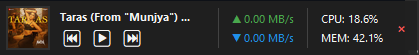

# 🚀 Windows 11 Taskbar Widget & Traffic Monitor


A sleek, **Windows 11-style Taskbar Widget** that combines a **real-time Traffic Monitor**, **System Resource Stats** (CPU/RAM), and a **Universal Music Player** controller into a single, compact interface. Designed to blend perfectly with the Windows 11 taskbar aesthetics.



## ✨ Features

### 📊 Real-Time Monitoring
*   **Network Traffic**: Live upload/download speeds with color-coded indicators
*   **System Resources**: CPU and RAM usage at a glance
*   **Auto-Refresh**: Configurable update intervals (500ms - 5s)

### 🎵 Advanced Music Control
*   **Now Playing Display**: Song title, artist, and album artwork
*   **Smart Playback Detection**: Dynamic play/pause button that reflects actual state
*   **Universal Compatibility**: Works with Spotify, YouTube, VLC, Windows Media Player, and more
*   **Audio Visualizer**: Real-time equalizer with 5 preset styles:
    - **Default**: Balanced visualization
    - **Bass**: Emphasizes low frequencies
    - **Treble**: Highlights high frequencies  
    - **Rock**: V-shaped profile (boosted bass & treble)
    - **Pop**: Mid-range focused

### 🎚️ Professional Audio Equalizer
*   **10-Band Graphic Equalizer**: Real system-wide audio enhancement
*   **Frequency Bands**: 31Hz, 62Hz, 125Hz, 250Hz, 500Hz, 1kHz, 2kHz, 4kHz, 8kHz, 16kHz
*   **Professional Presets**:
    - Flat, Bass Boost, Treble Boost
    - Rock, Pop, Classical, Jazz, Electronic
    - Vocal Boost, Bass & Treble
*   **Custom Profiles**: Adjust each band individually (-12dB to +12dB)
*   **Real-Time Application**: Changes apply instantly to all system audio
*   **Powered by Equalizer APO**: Industry-standard Windows audio processing
*   **Persistent Settings**: Your EQ profile is saved automatically

### 🎨 Customization
*   **Visibility Controls**: Show/hide individual sections (Traffic, System Stats, Music)
*   **Music Modes**:
    - **Always Show**: Music section always visible
    - **Auto-Hide**: Hides when no media is playing
*   **Themes**: Dark mode (Light mode coming soon)
*   **Transparency**: Adjustable opacity (95% default)
*   **Persistent Settings**: All preferences saved automatically

### 🖱️ User Experience
*   **Draggable**: Click and drag to reposition anywhere on screen
*   **Always On Top**: Stays visible above other windows
*   **Context Menu**: Right-click for quick settings access
*   **Native Aesthetics**: Matches Windows 11 taskbar design
*   **Auto-Startup**: Optional silent launch on login

## 🛠️ Installation

### Prerequisites
*   Windows 10 or Windows 11
*   Python 3.10 or higher

### Setup Steps

1.  **Clone the Repository**
    ```bash
    git clone https://github.com/yourusername/windows-11-taskbar-widget.git
    cd windows-11-taskbar-widget
    ```

2.  **Install Dependencies**
    ```bash
    pip install -r requirements.txt
    ```

3.  **Run the Widget**
    ```bash
    python taskbar_widget.py
    ```

4.  **[Optional] Install Equalizer APO for Audio EQ**
    
    To enable the professional 10-band audio equalizer:
    
    a. Download Equalizer APO from [SourceForge](https://sourceforge.net/projects/equalizerapo/)
    
    b. Run the installer and select your audio playback device
    
    c. Restart your computer
    
    d. Right-click the widget and select "🎚️ Audio Equalizer..." to access the EQ controls

## ⚙️ Configuration

### Context Menu Options (Right-Click)

*   **Show Traffic** - Toggle network speed monitor
*   **Show System Stats** - Toggle CPU/RAM display
*   **Music Modes**:
    - Always Show Music
    - Auto-Hide Music (when nothing playing)
*   **Visualizer Style** - Choose from 5 visual presets
*   **🎚️ Audio Equalizer** - Open 10-band graphic equalizer (requires Equalizer APO)
*   **Reset Position** - Return to default bottom-left corner
*   **Exit** - Close the widget

### Configuration File

Settings are automatically saved to `widget_config.json`:

```json
{
    "show_traffic": true,
    "show_system": true,
    "music_mode": "always",
    "viz_preset": "Default",
    "position": {"x": 0, "y": -1},
    "theme": "dark"
}
```

## 🚀 Auto-Start Setup

To launch automatically with Windows:

1.  Run the setup script:
    ```bash
    python setup_startup.py
    ```
2.  This creates `TaskbarMonitor.bat` in your Startup folder
3.  Widget will launch silently on next login

## 🧩 Requirements

*   **Core Libraries**: 
    - `psutil` - System monitoring
    - `Pillow` - Image processing
    - `pyautogui` - Media key simulation
*   **Windows Runtime Libraries**: 
    - `winrt-runtime`
    - `winrt-Windows.Media.Control`
    - `winrt-Windows.Storage.Streams`
    - `winrt-Windows.Foundation`

## ❓ Troubleshooting

**Music Info Not Showing?**
- Ensure "Show media controls" is enabled in your browser/music app settings
- Windows 11 Global Media Transport Controls must be active (usually automatic)
- Try playing/pausing media to trigger detection

**WinRT Installation Issues?**
- Update pip: `python -m pip install --upgrade pip`
- Install Visual C++ Redistributable if needed
- Try installing packages individually if batch install fails

**Widget Not Staying On Top?**
- Check if another "always on top" app is conflicting
- Try restarting the widget

**High CPU Usage?**
- Increase update interval in config (reduce refresh rate)
- Disable visualizer if not needed

## 🎯 Keyboard Shortcuts (Coming Soon)

*   `Ctrl + Alt + M` - Toggle music controls
*   `Ctrl + Alt + H` - Hide/Show widget
*   `Ctrl + Alt + R` - Reset position

## 🤝 Contributing

Contributions are welcome! Ideas for future features:
- Weather integration
- Stock ticker
- Calendar events
- Custom themes
- Multi-monitor support
- Spotify API integration for lyrics

Feel free to fork and submit pull requests!

## 📄 License

This project is licensed under the MIT License - see the LICENSE file for details.

---

**Keywords**: Windows 11 Taskbar, Traffic Monitor, Network Speed Meter, Python Widget, System Monitor, Music Controller, Taskbar Customization, Desktop Widget, WinRT, Media Controls, Audio Visualizer, EQ Presets
